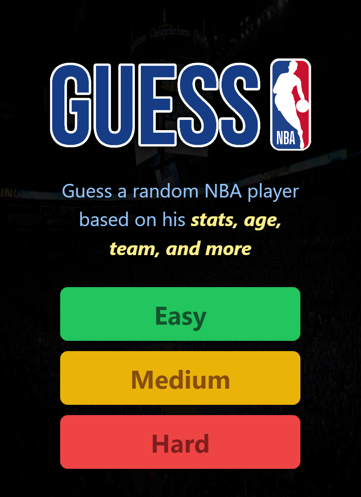
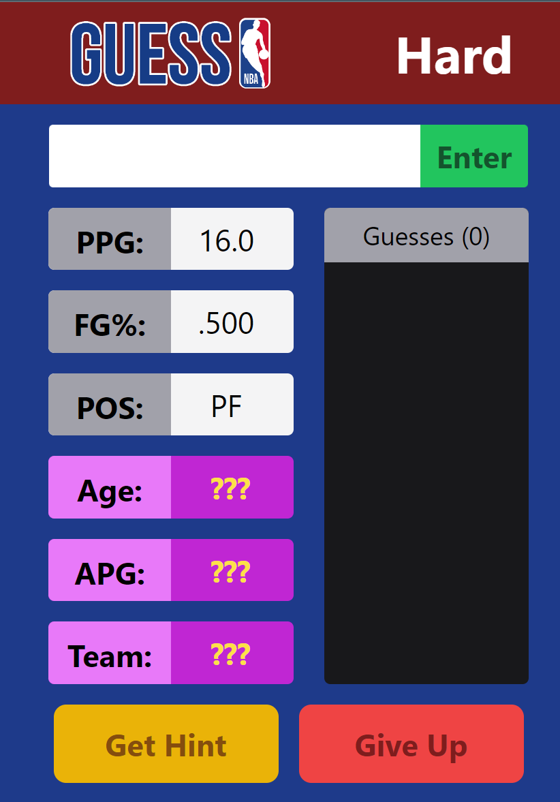

# GuessNBA

<i>Created: Winter Break 2022-2023 (College Freshman)</i>

  
  

<b>GuessNBA is a mobile-based web game in which a user has to guess a random NBA player based on three of their stats, or more if they need hints.</b>

The program scrapes NBA data from the website basketball-reference.com and finds information about a random player. 

  <b>Tools used:</b>
 - JavaScript - React
 - Python - Flask
 - HTML/CSS - Tailwind
 - Beautiful Soup
